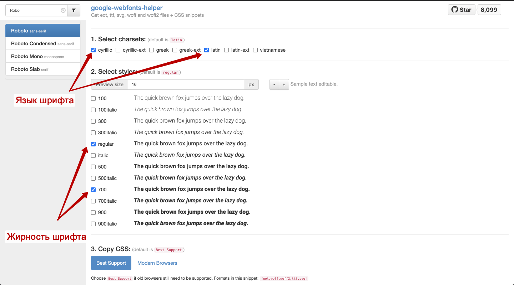
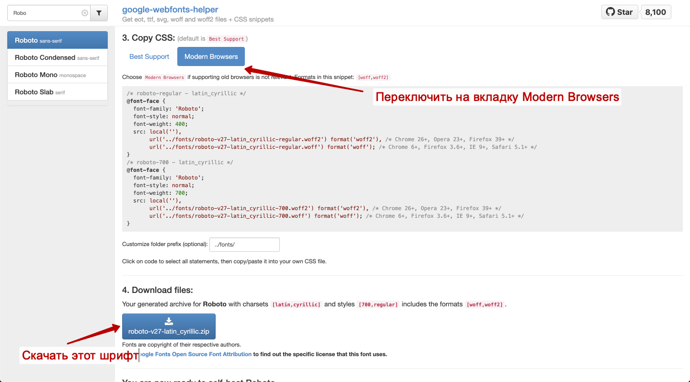
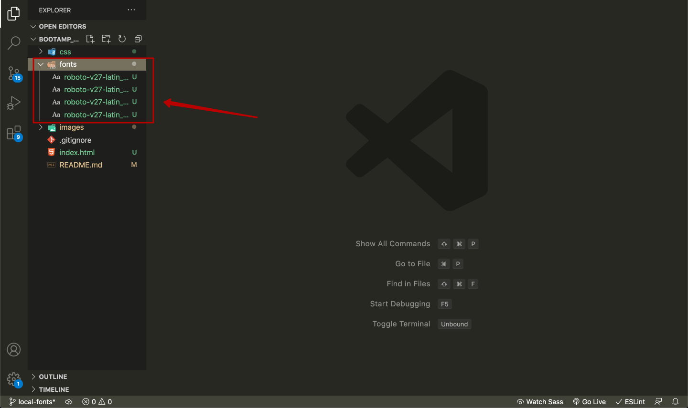
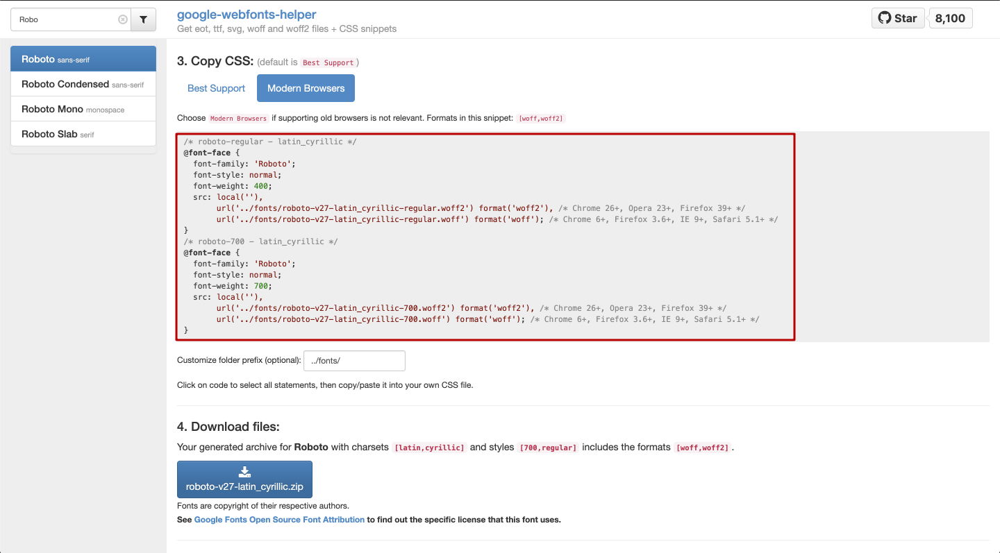
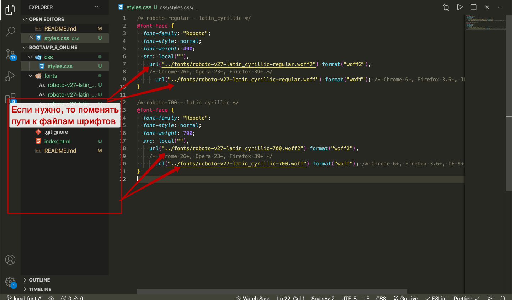
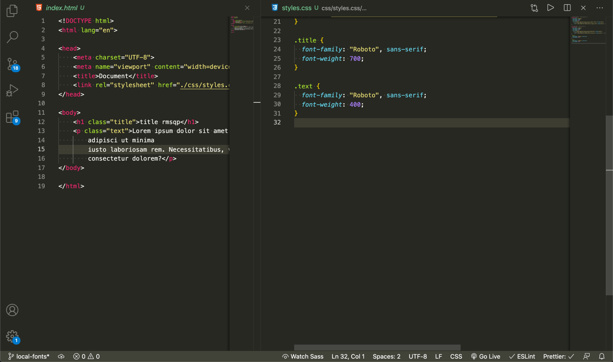
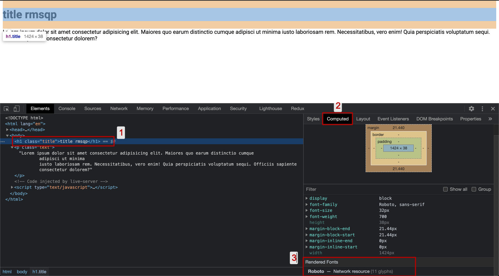
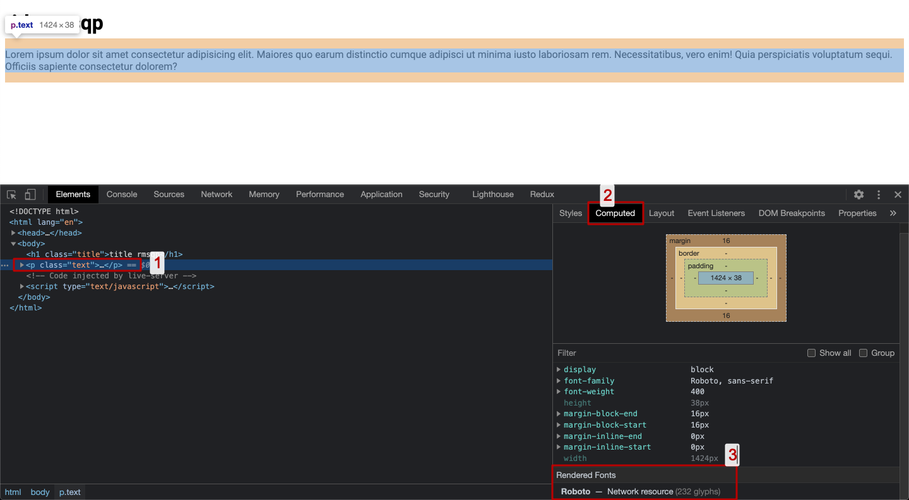

# Подключение локальных шрифтов

## 1. Найти и скачать нужный шрифт

---

- зайти на [google-webfonts-helper](https://google-webfonts-helper.herokuapp.com/fonts)
- найти нужный шрифт
- выбрать интересующий язык и жирность шрифта 
- переключиться на Modern Browsers, что бы шрифт скачивался в двух форматах woff и woff2. Скачать шрифт. 
- распаковываем архив и переносим всё содержимое к нам в проект, в папку fonts 

## 2. Подключение шрифта

---

- Скопировать директивы `@font-face`, которые предлагал google-webfonts-helper 
- Вставить эти диркетивы вверху наших стилей, если есть `:root`, то после него 
- Внутри директивы `@font-face`, идёт описание шрифта, если копировали с google-webfonts-helper, то ничего там менять не надо.

## 3. Проверяем работоспособность шрифта

---

- 
- 
- 
